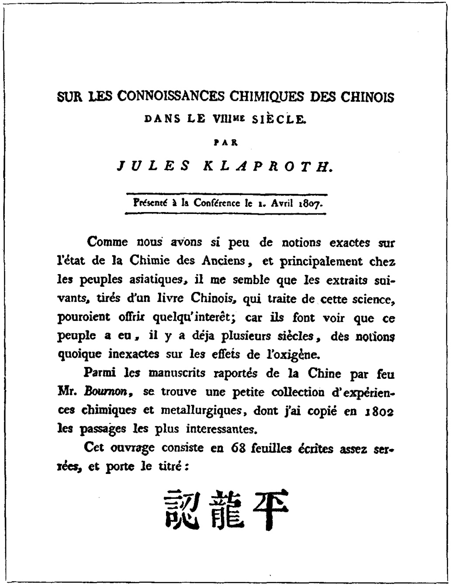
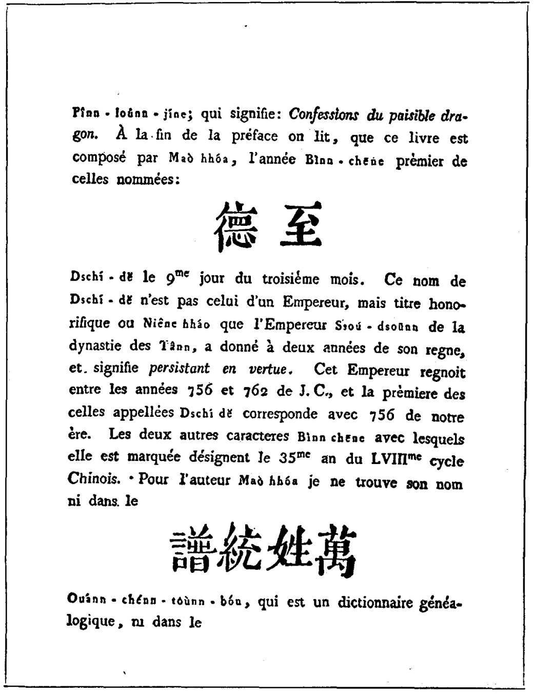
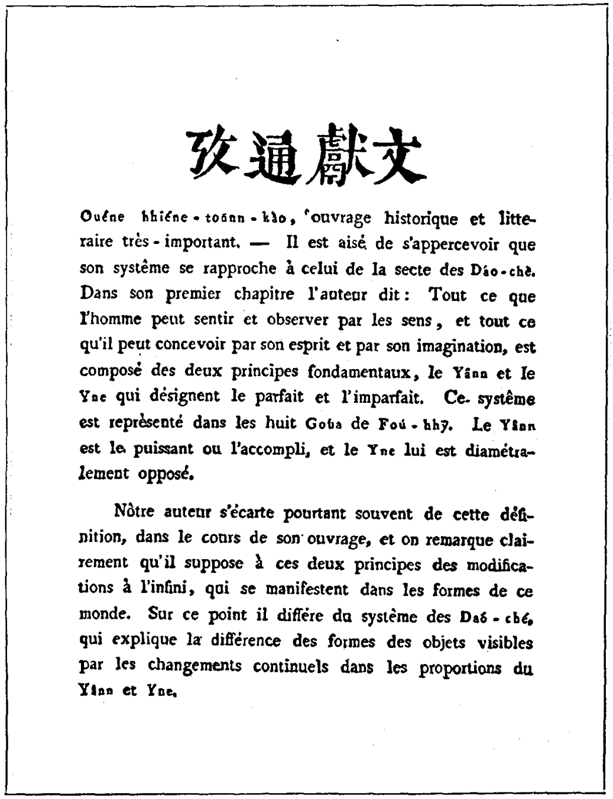
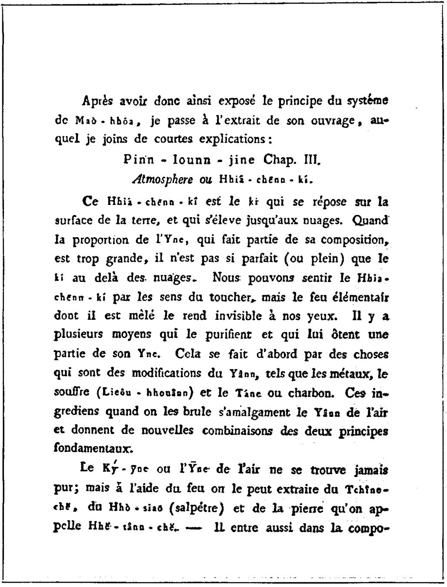
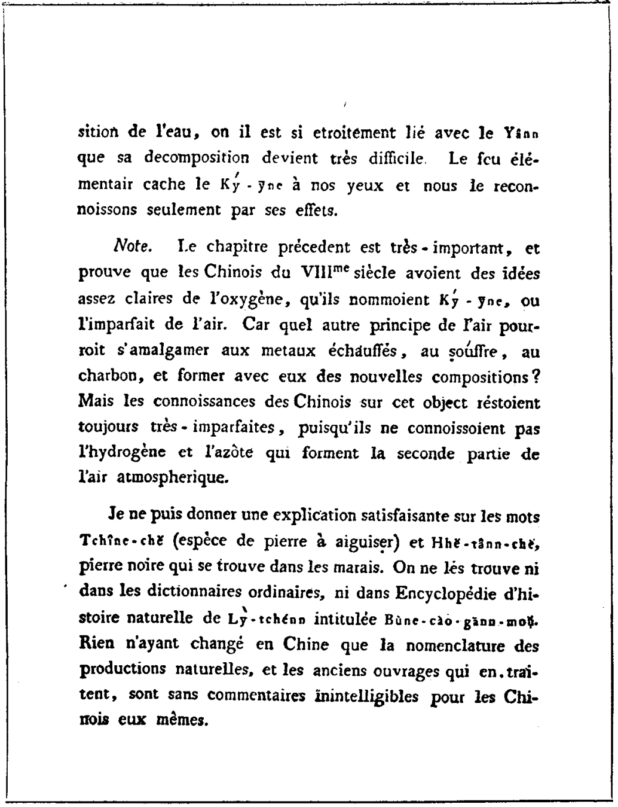
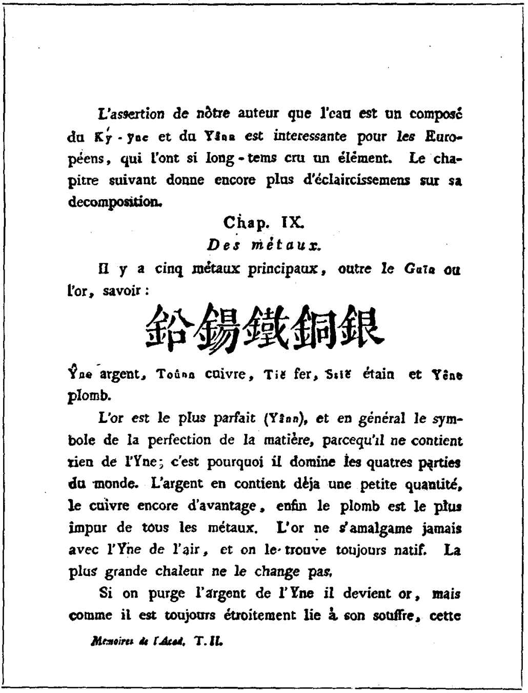
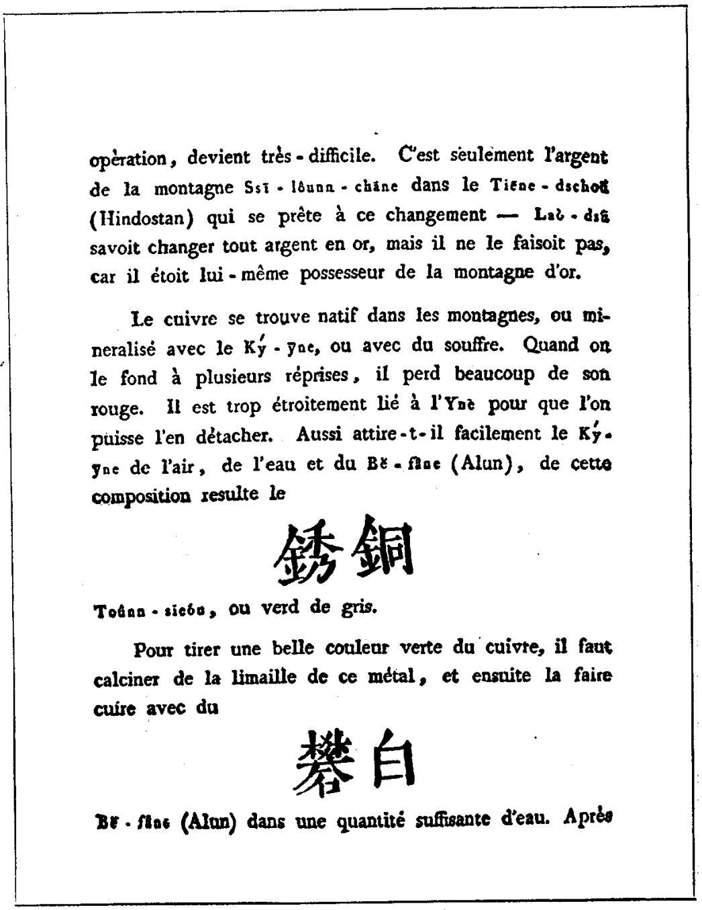
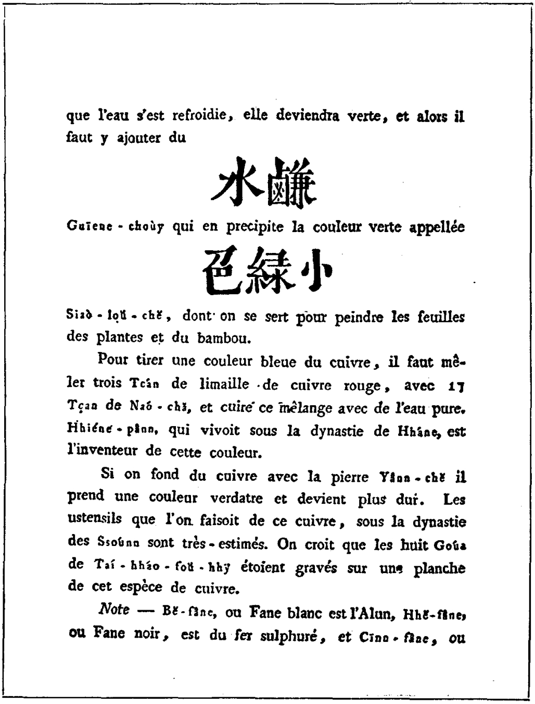
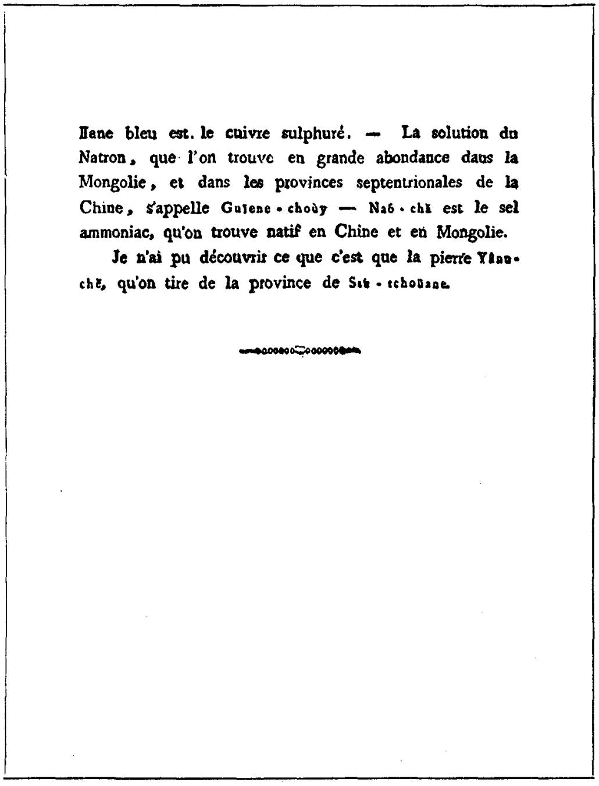

# 中文互联网兔子洞冰山图拾遗·柒·平龙认

---

## 简介

《平龙认》是一部存在性待定的中国古代堪舆学或炼丹学著作。1807年，德国东方学家朱利阿斯・克拉普罗茲在其论文中首次提及了该书，并摘录和翻译了据称来源于《平龙认》的两个章节，其中《含真气》（或译为《霞升气》）一节被认为可能是世界最早的有关氧气的观测记录。由于《平龙认》原书至今尚未被发现，除克氏的孤证外也始终没有更多证据出现，因此其真实性受到了部分研究者的质疑。

---

## 时间线

> 
第八世紀中国人的化学知識

> 
> 
亨利克・朱利阿斯・克拉普罗茲著

> 
> 
——1807年4月1日在俄国聖彼得堡科学院大会上宣讀的論文——

>  
> 
在以前，人們是怎样地研究化学，那种情形，我們因为缺少正确的认識，因而亦就不能体会得出来；尤其是对于亚洲民族的情况，更是如此。现在，我从一本中国的化学书中，摘录出几段来，写在下面。从这几段記載里，很可以看得出中国的人民在好几百年前，就已經有了关于氧气的概念，虽然这一种概念，并不是十分正确；可是，也許能从这里，可以引起大家的研究兴趣。

>  
> 
最近逝世的波尔南先生（Mr. Bournon），在他从中国带回的一些手抄本里，有一本小书，是专叙述化学和冶金的經驗，其中有好几段，确有很精彩的见地，在1802年时候，我就把这几段抄下来了。

>  
> 
这本小书一共有68頁，书名叫《平龙认》——意思是靜龙的自白（Confessions du paisible dragon）。在序言的末尾說明这本书是馬和（Maò hhóa）著的，时間是丙申，也就是至德元年3月9日。这里至德两个字，并不是那个皇帝的名字，而是一种尊号或是年号；还是唐朝肃宗在位二年的时候，他自己封的。至德二字的意义，是說“德之久也”。这位皇帝当权的时期是从西历756年起到762年为止，至德元年正是西历756年。丙申两字的意义，則是表明第58循环的第35年。至于作者馬和的姓名，我在《万姓統譜》（一种中国人的姓譜）里并沒有找到；又在《文献通考》里（一部文学和历史的重要著作），也沒有查出来。依照他的說法，显而易见的是近于道家。在第一章里，著者說：凡是能被人的五官可以感觉得到和观察得到的东西，凡是能被人的精神和猜想力可以推想、可以摸索的东西，都是由两种基本元素所构成，这两种元素就是阳和阴。阳是說尽善尽美，阴却是尽善尽美的反面。这种学說，早在伏羲所作的八卦里已經闡发得很詳細了。又一种意思，是阳代表权力或完善；阴所代表的，正是前者的反面。

>  
> 
这个定义，著者在书里，常时避免提到它。其实，在他的书里，我們可以明显地看出来，而他正是根据这两个原則，去推想那表现在世界上各形式之中的，是有着无穷的变化。如若从这一点来观察，他和道家学說是有所不同，因为后者解释人眼里所见的事物种种不同形式，恰是由于阴阳比例的連續变动。

>  
> 
馬和学說的原則，我既是这样的述說过了，现在我还要进一步节录出他书中的一段，并加上簡短的說明，以告讀者。

>  
>  
> 
平龙认第三章

> 
> 
大气或含真气（Hhiá-Chenn-Ki）。

>  
> 
含真气是靜止在地面上以及升到云表的气体。当阴的成分——它是組成大气的分子之一——显得太大，这时候地面上的气，便不如云表以上的气，更为完善或更为充滿。即使用人的触觉，也可以感觉到含真气（Hhiá-Chenn-Ki）的存在，但是因为气里含有火素（Feu elementair）在內，所以我們的肉眼就看不见它了。气的成分，有許多方法可以提取，并且可以取出其中“阴”的一部分。最先，可以用阳的变化物来萃取它，譬如金属、硫磺和碳这一类东西。当我們燃烧的时候，这些原质便和空气中的阳体相混合，最后发生了这两种元素的新混合物。

>  
> 
阴气是永远不純淨的。但是用火来热它，就能够从青石（Tchîne-chě）、火硝和黑炭石（Hhé-Tann-ché）中取得。水里也有阴气，它和阳气紧密地混合在一起，很难使它們分解；火素中虽也隐藏有阴气，肉眼却看不到；我們所能见到的，只有阴气所发生的现象。

>  
> 
（注）前面这一章，非常重要。中国人在第八世紀，对于氧气就已經有了相当明了的观念；在这里足以証明了他們叫它做阴气或叫做不完善的气体。假若不照这样解释，試問还有什么別的气体成分，能和烧热的金属、或硫磺和木炭相混合，可以組成新的混合物呢？不过，中国人对这件事的认識，永远是不完全的，因为他們并不知道大气的組成，除此以外，还有氫和氮这两个重要的元素。

>  
> 
对于青石（Tchîne-chě 磨石的一种，磨刀用的）和黑炭石（黑色石头，可在低湿田地中见到），要給以滿意地說明，我們还不能够。纵然在一般字典里和李时珍著的《本草綱目》里也都查不出来。实际上，中国人所著关于自然物产的名称，以及名称有关的古代著作，即使中国人自己也大多看不懂；这种情形，直到目前仍旧未变。

>  
> 
著作确定了水是阴气和阳气的混合物，这对欧洲人来說，是有兴趣的，因为欧洲人曾經相信水里只有一种元素（élément），下面一章对于水的分解，他解释得更加明了。

>  
>  
> 
第九章 金屬

>  
> 
主要的金属有五种，除去黄金以外，还有銀、銅、鉄、錫和鉛。金是最完善的（属阳），通常是在物质上用来代表尽善尽美的象征；因为黄金里面并不含着有阴，所以它的价值重于四海。銀里面已經含了少量的阴，銅里面更多些，鉛是一切金属中頂不純淨的了。金从来不和阴气相混合，而且經常保持它的原状，即使加以极高的热度，也不会使它改变。

>  
> 
假設我們把銀里面的阴拿出来，那末銀就变成了黄金；但是因为銀是常常和它所含的硫磺相密結，所以提取的手續就非常困难了。只有天竺（Hindostan）錫兰山（Ssi-lôunnchāne）所产的銀是能够这样变的。老家（Laò-dsu）能把一切的銀化而成金；可是他却不去化炼，因为他本来就是金山的主人。

>  
> 
在高山里的銅，或者依然保存它的本质，或者已經和阴气化合，或者已經和硫磺化合，我們如若把它熔冶几次，它便要逐漸消失了本来的紅色。銅和阴的关系很是密切，所以分解也很难。銅又很容易吸取阴气或水和白矾，因此成了銅銹，或叫做銅綠。

>  
> 
設欲提取美丽的銅綠色，必須先把銅的碎末烧焦，用白矾和适量的水加进去，再一同烧煮。等待水冷了以后，水就变作綠色了。这时候需要再加碱水，使它沉淀为“小綠色”；人們多用它来繪画植物的叶子和竹叶。

>  
> 
如若想提取銅蓝色，就需再混合紅銅屑3勺（Toán）和硇砂（Naó-chă）17勺，外加純水煮熬。汉朝的秦班（Hhiéne-pann），便是这种顏色的发明人。

>  
> 
若是把銅和着盐石（Yânn-chě）一同熔化，那末在銅上就生出綠色，而且变硬，商朝（Ssounn）采用了这种銅造成的器皿，一向十分著名。一般人所相信的太昊伏羲（Tai-hháo-fou-hhy）的八卦，原来就鐫刻在这种銅版的上面。

>  
> 
（注）按白矾（Bě-fâne）就是普通的矾（Alun），黑矾（Hhě-fâne）是硫化鉄，青矾（Cinn-fâne）是硫化銅。天然碱（Natron）在蒙古和中国北部，是最多的溶液，名叫做碱水（Guiene-choùy）。硇砂就是銨盐，也叫做硇盐（Sel ammoniac），在中国本部和蒙古都有出产。

>  
> 
在四川省掘得的盐石（Yânn-chě），我还不能发现它是什么东西。

---

## 附录：引自商务印书馆《化学元素的发现》

