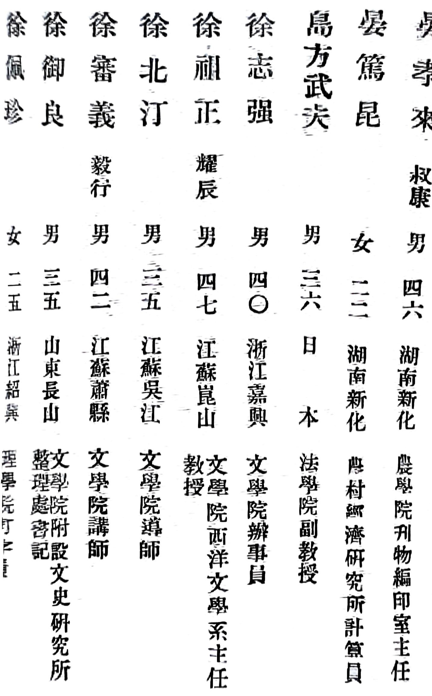

# 中文互联网兔子洞冰山图拾遗·伍·人肉蜡烛

---

## 简介

“人肉蜡烛”之说出自1925年《上海画报》第47期刊载的《人肉蜡烛》一文。作者借由此文讲述了自己在医院休养期间见证的一桩惨事：一名被卖入妓院的十四五岁少女，因遭老鸨诬陷偷钱，竟被施以“人肉蜡烛”的酷刑，即以浸过煤油的棉花裹住手指焚烧，致使皮烂骨露，最终不得不截去残指。文章作者化名LL女士，笔者仅能不负责任地推测，其真实身份或为山水画名家徐北汀之妻。

---

## 基本信息

|  标题  |  署名  |        完稿时间        | 刊载报刊 |  期号  |        发行时间        | 版次  |
|:----:|:----:|:------------------:|:----:|:----:|:------------------:|:---:|
| 人肉蜡烛 | LL女士 | 民国14年（1925年）10月21日 | 上海画报 | 第47期 | 民国14年（1925年）10月24日 | 第2版 |

---

## 原文内容
 
> 
人肉蠟燭

> 
> 
LL女士

>  
> 
我結婚以後、身體時常多病、前月產後、格外虛弱、加之我所生一兒、不久殤去、我的心境愈加不順、我之夫、寫信給我、囑我入醫院養病一兩月、暫時脫離家庭的環境、我便依了他的話、入滬西某私人醫院裏養病、我為什麼要入這私人病院呢、因為公眾的醫院、病人太多了、未免有時候嘈雜、這種小規模的醫院、與我的病體最宜、不料因此發見一件狠慘痛的事、寫出來、告訴世界上的人、

>  
> 
當我入醫院的第三天、在我隔壁房間裏的一間小病房中、忽然來了一位女病客、這女病客、是一個十四五歲的女郎、衣服雖然也是絲織品、不過俱是陳舊的、一望而知是成年人穿舊了、改造給他的、這女郎的面目狠憔悴、好像他▢日在大愁恐怖中討生活、他的行動狠自然、沒有什麼大病現象、右手的第二指上，却用狠厚的棉花繃帶緊裹著、並且裹紮得狠粗、我想這女郎、或許是患疔瘡吧？

>  
> 
那女郎一住三四天、白天也出病房、到陽台上透日光、我見了好幾次、有些面熟了、到了第五天、我便問他、姑娘、你手指上是疔▢嗎、他搖搖頭道、不是、我說、那末是什麼、他說、是被火燒的、我驚訝道、是火燒的嗎、那末你府上失火嗎、他又搖搖頭、道沒有失火、不過我的一隻指頭燒斷了、我道、怎樣、會燒到了呢、不小心燙傷、灼傷是有的、怎麼會燒斷了呢、他說、燒是沒有燒斷、已經燒到將斷未斷的時候、到這醫院裏來、請醫生給我截斷了的、因此此刻我右手第二指、只有一半、我道、可憐啊！ 怪不得你的第二指、比較短一些呢、

>  
> 
我追問他怎麼會燒斷、他起初說是在灶下跌了一交、手指誤觸火爐、因此燒了半截、我駁他道、沒有這樣的事、你手指觸著火爐、還不趕緊縮轉來嗎、至多不過是灼傷罷了、萬萬沒有聽他、燒指頭的事、他聽了我這話、低頭不響了、却望著斷指哭、

>  
> 
經我子細一問、原來這女郎、是從小被父母賣給一家做娼妓營業人家、所謂老鴇者、對於他磨折責罰、無日▢之、他也覺得是很普通的了、最近因為老鴇遺失鈔票幾塊錢、老鴇便說是他偷去的、他抗辯、萬惡的老鴇、便用棉花醮了蔴油、裹在他的右手第二指上、點上火柴焚燒、無奈、蔴油不甚引火、點了半天沒有燒成、萬惡的老鴇、換了方法、除去了蔴油棉花、另外用棉花醮了美孚牌煤油、唉、煤油棉花、一經火柴燃著、豈有不燒斷指頭的道理、當時有兩個人執著那可憐的女郎手、使他不能抵抗、瞧著他燃燒這人肉蠟燭、據可憐的女郎說、共總燃燒多少時間、他也不知道、因為他已被燒得暈了過去、等到醒來、第二指已皮爛骨露、他呼號慘痛了一夜、那萬惡的老鴇、先送他到一個江湖走方郎中去看、給了些藥、痛雖略止、膿血潰爛不堪、幸虧老鴇有一男客、出了慈善心、引導他到這私家醫院裏來、上了悶藥、截斷了半截殘指、方▢漸漸的止痛……

>  
> 
我問明了這一種實在情形、我義憤填胸、要奔告院長、舉發到公堂、嚴辦這萬惡的鴇母、恰恰這一天院長到蘇州去了、沒有解决這問題、隔了一天、那女郎一早又出院、等到我去尋他、他已不見了、據院役說、是他的家屬領他回去了、唉！我想世界上有這種燃燒人肉蠟燭的家屬嗎！後來我告訴了醫院院長、院長道、我也疑心、無心的火灼傷、手指决不致如此受創、詰問病源、始終不肯詳細說、却不料內中有這麼一段慘史、可惜他去了、否則、我也狠願到公堂上做一個負責任的證人、

>  
> 
十四、十、廿一、上海、白克路、

---

## 作者身份辨析

笔者大略地汇总了署名“LL女士”或“LL”者在民国各报刊、杂志上的刊文情况，具体如下：

|      发行时间      |   刊载报刊    | 报社所在地 |        标题        |
|:--------------:|:---------:|:-----:|:----------------:|
|  1924年12月07日   |    吴江     |  吴江   |  東吳大學吳江同鄉會交誼會記   |
|  1925年06月20日   |   上海画报    |  上海   |       	無題        |
|  1925年10月24日   |   上海画报    |  上海   |       人肉蠟燭       |
|  1925年11月08日   |   国闻周报    |  上海   |       上海之新       |
|  1926年04月08日   | 	新闻报本埠附刊  |  上海   |      	鬢花零話       |
|  1926年06月25日   |    明报     |  上海   |        雲社        |
|  1926年07月03日   |   民国日报    |  上海   |      	銀海雜談       |
|   1926年第02期    |    桐声     |  北平   |     應當改革之五高      |
|  1927年01月16日   |    大公报    |  天津   |      	皇宮遇怪記      |
|  1927年02月08日   |    大公报    |  天津   |     	影戲場中所聞      |
|  1927年08月23日   |   工商日报    |  无锡   |     	魏秀寳臨別▢涕     |
|  1928年03月18日   |    大公报    |  天津   |        病中        |
|  1931年01月01日   |    正气报    |  上海   |        /         |
|  1934年01月13日   |   中国论坛    |  上海   |   南京成立了三個人的分會    |
|  1934年01月30日   |    民报     |  无锡   |  無聊的談天：給商店靑年職員們  |
|  1934年01月31日   |    民报     |  无锡   |  無聊的談天：給商店靑年職員們  |
|  1935年01月07日   |    人报     |  无锡   |      趙長生自殺       |
| 1935年第13期（约6月） |    方舟     |  天津   |    介绍几种治腋下狐臭法    |
|  1935年06月20日   |   盛京时报    |  奉天   |     鐵爾登論握拍法      |
|  1935年06月21日   |   盛京时报    |  奉天   |   	鐵爾登論握拍法（續）    |
|  1937年08月29日   |   盛京时报    |  奉天   |     談東京的舊書舖      |
|  1939年02月02日   |   盛京时报    |  奉天   |        海濱        |
|  1939年02月03日   |   盛京时报    |  奉天   |      濱海（續）       |
|  1939年02月04日   |   盛京时报    |  奉天   |      濱海（續）       |
|  1941年07月19日   |   三六九画报   |  北京   |     狄四娘演前演後      |
|  1941年10月11日   |    吾友     |  北京   |   公演“原野”与“雷雨”    |
|  1943年01月01日   | 北京大学工学院新闻 |  北京   |     乒乓球隊之概觀      |
|  1946年07月16日   |    大锡报    |  无锡   | 熔中西精髓於一爐：俞畫的獨特風格 |

不妨假设这位“LL女士”总是倾向于投稿给离自己居住地不远的报社，则其部分人生轨迹已然呼之欲出：

|       时间        | 居住地 |
|:---------------:|:---:|
| 1925年6月-1926年7月 | 上海  |
| 1927年1月-1927年2月 | 天津  |
|     1928年3月     | 天津  |
| 1934年1月-1935年1月 | 无锡  |
| 1935年6月-1939年2月 | 奉天  |
| 1941年7月-1943年1月 | 北京  |
|     1946年7月     | 无锡  |

此外，“LL女士”似乎也和东吴大学吴江同乡会存在一定的联系，因此才会撰文《東吳大學吳江同鄉會交誼會記》，以亲历者的口吻描述了自己在这一交谊会上的见闻。不过，这尚不能说明她曾就读于东吴大学，亦不可轻易推断其为吴江人氏。据查，东吴大学各地方同乡会曾广泛吸纳过在苏州工作、学习的同籍贯人士，并不拘于东吴大学学生\[1\]，何况据《人肉蠟燭》一文，“LL女士”约1925年8月即于上海诞下一子，若其1924年12月仍为在校学生，时间上未免过于紧张了。再者说，“LL女士”在南方的活动范围局限在了上海、无锡一带，除《交誼會記》一稿外再无提及吴江，亦不似籍贯在此。故笔者推测，“LL女士”极有可能与东吴大学吴江同乡会的某位成员存在较亲密的关系，因此受邀参加了交谊会。更大胆地说，这位“亲密人士”或许正是她的丈夫，而这恰好又与《人肉蠟燭》里提及的“与夫分居两地、依靠写信往来”相符合，即二者一居上海、一居苏州。

同样的道理，亦不可因为1943年元旦《北京大学工学院新闻》上的刊文，而轻易将“LL女士”视作日伪统治下的“伪北大”之教员。首先，纵观“LL”所作诸文，无一字一句与工学有关；再考虑到她先前有关网球握拍法的系列文章，其人恐怕相当热心体育，而此时的“伪北大”工学院乒乓球队“打遍了国立各院校”，连战连捷，“获得了卅一年度的冠军”，风头一时无两，“LL女士”受其吸引，激赏之余，借助某种身份上的便利，作为外来的看客前往采访球员、撰下此文，同样是有可能的。其次，若其确为“伪北大”之教职员工，在自家内部刊物上发文，又何必重拾“LL”的化名、遮掩起本来面目呢？故笔者仍提出与先前相似的猜测，“LL女士”虽与“伪北大”有关，却也只是作为职员家属一类，而非直接受雇于此。

综合上述推论，在翻阅了若干文献后，笔者认为“LL女士”的真实身份或为山水画名家徐北汀之妻。据《記徐北汀》\[2\]、《黎里镇志》\[3\]及吴江区档案馆相关页面\[4\]：徐北汀（1908年7月-1993年9月），原名徐熹，字北汀，笔名舒澄、石梅、淼翁等，江苏吴江人，师从江南名画家吴观岱，年少成名，17岁即有作品入选《近代名人画集》，早年曾在苏州、上海两地创办白马画社，1939年起任北京大学文学院艺术研究会国画导师。笔者亦检索到了1942年12月编印的《國立北京大學教職員錄》，徐北汀先生此时仍列名其中，任“文學院導師”。

---

## 参考文献

[1] 张燕. 东吴大学学生社团研究（1901-1952）[D]. 苏州大学, 2015.

[2] 洪偉明. 記徐北汀[J]. 新民报半月刊, 1940, 2(17):39.

[3] 佚名. 黎里镇志 第十七卷 人物[EB/OL]. (2014-12-02)[2025-05-18]. http://www.wujiangtong.com/webPages/DetailNews.aspx?id=12545.

[4] 佚名. 徐北汀[EB/OL]. (2024-05-14)[2025-05-18]. http://www.wujiangtong.com/webPages/DetailNews.aspx?id=5979.

---

## 附录：引自上海图书馆《民国时期期刊全文数据库》

